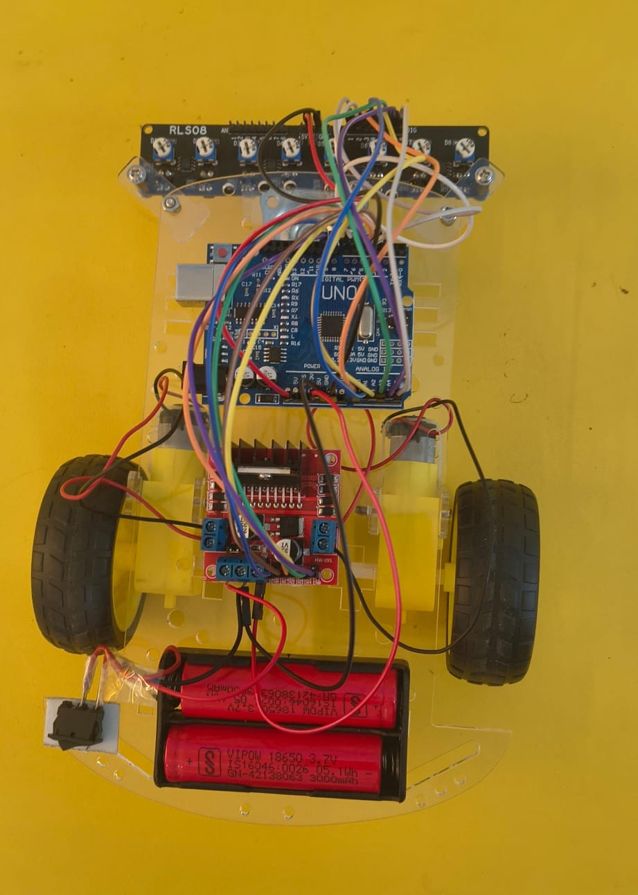

# 🤖 Arduino PID Line Following Robot

An Arduino UNO-based **8-channel PID line-following robot** using the SmartElex RLS-08 line sensor and L298N motor driver.

## 📌 Project Overview

This robot is designed to automatically follow a black line using an 8-channel IR sensor array.

The robot uses **PID (Proportional–Integral–Derivative) control** to continuously adjust the motor speeds and maintain smooth and accurate line tracking.

## 🧰 Components Used

* Arduino UNO
* SmartElex RLS-08 8-Channel Line Sensor
* L298N Motor Driver
* 2 × DC Gear Motors
* Robot Chassis
* Wheels
* Battery
* Jumper Wires

## 🔌 Sensor Connections

| RLS-08 Sensor | Arduino UNO |
| ------------- | ----------- |
| IR1           | D2          |
| IR2           | D6          |
| IR3           | A0          |
| IR4           | A1          |
| IR5           | A2          |
| IR6           | A3          |
| IR7           | A4          |
| IR8           | A5          |
| VCC           | 5V          |
| GND           | GND         |

> **Note:** IR1 is physically positioned on the **left side** of the robot.

## ⚙️ Motor Driver

The L298N motor driver controls the left and right DC motors.

The Arduino adjusts the motor speeds according to the position of the line detected by the RLS-08 sensor array.

## 🧠 How It Works

1. The RLS-08 sensor detects the black line.
2. The eight sensors determine the position of the line.
3. The Arduino calculates the **error** between the robot's center and the line.
4. PID control calculates the required correction.
5. The motor speeds are adjusted accordingly.
6. The robot continuously corrects its direction to stay on the line.

## 🎯 Features

* 8-channel IR line detection
* PID-based control
* Smooth line tracking
* Automatic left/right correction
* Sharp-turn handling
* Arduino UNO based
* Low-cost robotics project

## 🎥 Demo Video

The demonstration video is stored directly inside this repository.

```text
video/
└── line-following-robot.mp4
```

**Demo Video:**
[▶️ Watch the Line Following Robot](video/line-following-robot.mp4)

> **Note:** Upload your video inside the `video` folder and keep the filename as `line-following-robot.mp4`, or update the link above with your actual filename.

## 📁 Project Structure

```text
line-following-robot/
│
├── video/
│   └── line-following-robot.mp4
│
├── line_following_robot.ino
├── README.md
└── images/
    └── line-following-robot.jpeg
```

## 📸 Project Images




## 💻 Code

The Arduino source code is available in this repository.

Main file:

```text
line_following_robot.ino
```

## 🚀 Future Improvements

* Better PID tuning for high-speed tracks
* Improved sharp-turn handling
* Encoder-based motor control
* OLED/LCD status display
* Wireless PID tuning
* Higher-speed motors

## 👨‍💻 Author

**Utsab Ghosh**

Robotics Engineer | AI & Automation Specialist

---

⭐ If you find this project useful, consider giving the repository a star!
